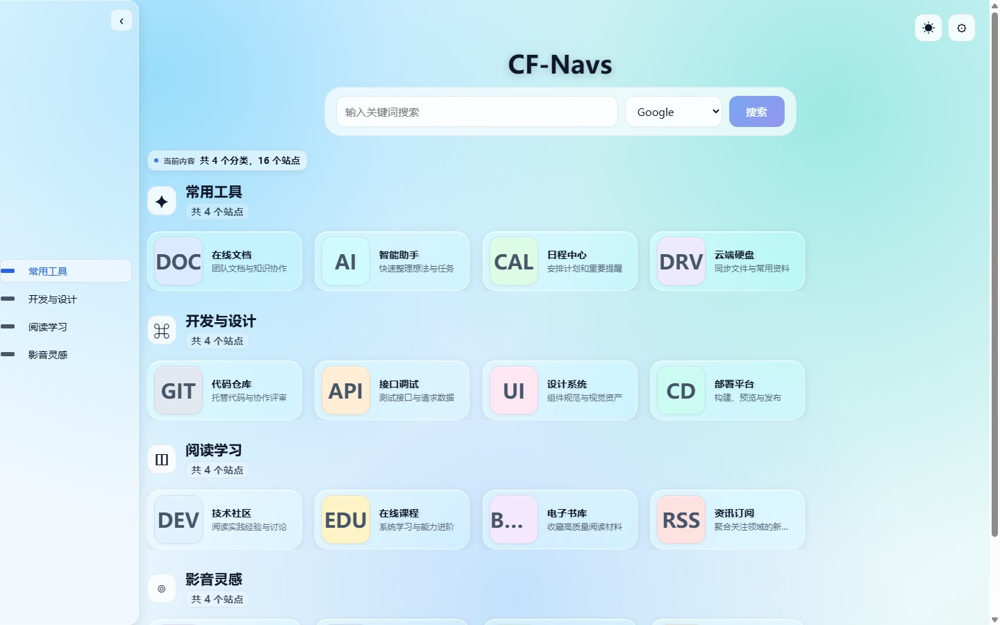
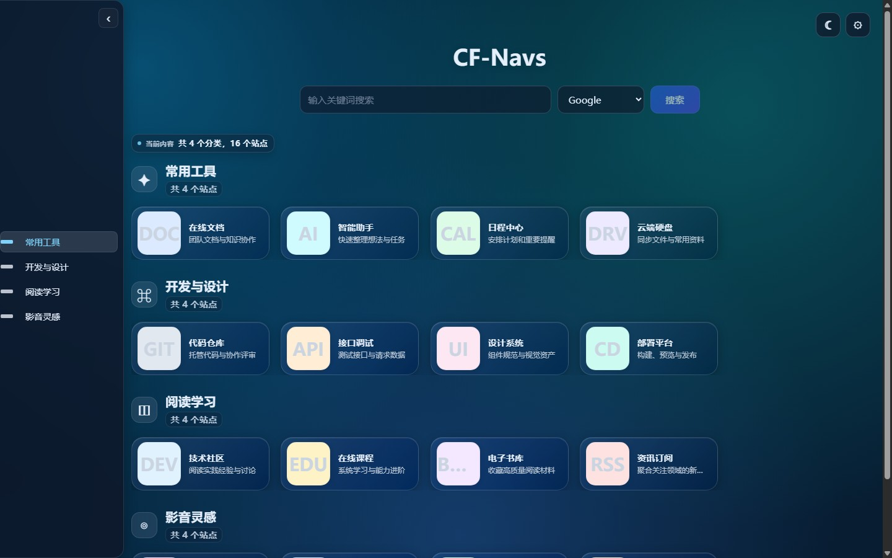
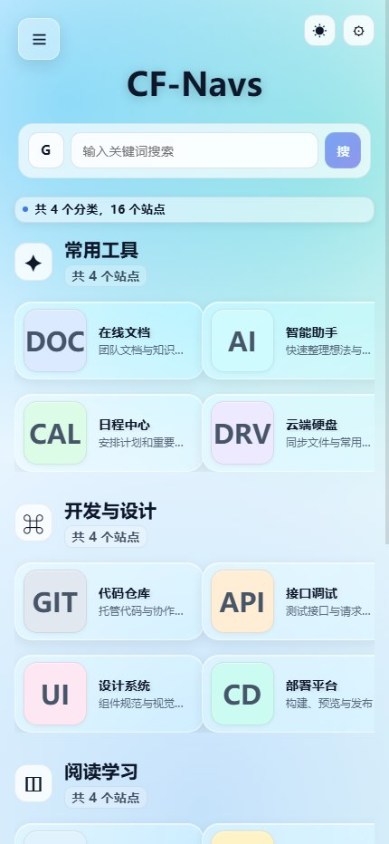
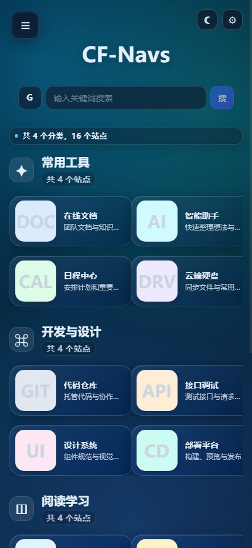
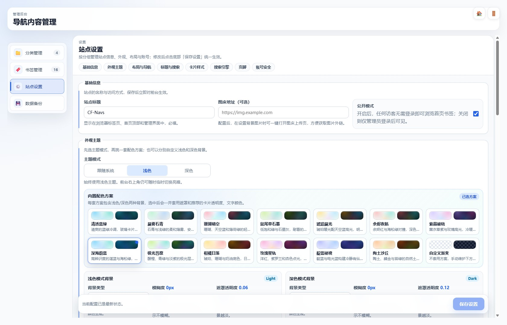
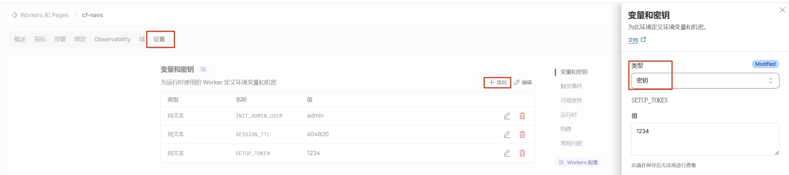

<div align="center">
  
  <h1>CF-Navs</h1>
  <p>运行在 Cloudflare Workers 上的轻量个人导航面板</p>
  <p>在一个清爽、响应式的界面中管理分类、书签、主题、搜索服务与数据备份。</p>

  <p>
    
    
    
    <a href="LICENSE"></a>
  </p>

  <p>
    <a href="#功能">功能</a> ·
    <a href="#界面预览">界面预览</a> ·
    <a href="#快速部署">快速部署</a> ·
    <a href="#本地开发">本地开发</a> ·
    <a href="docs/README.md">项目文档</a>
  </p>

  <a href="https://github.com/lbjxr/CF-Navs/fork">
    
  </a>
</div>

---

## 功能

| | 能力 | 说明 |
|---|---|---|
| ☁️ | 边缘全栈 | 前端、API、D1 数据库与 KV 会话均运行在 Cloudflare，无需自建服务器 |
| 🧭 | 导航首页 | 所有一级分组同时展示、组内二级分类横向切换、完整路径搜索，以及一致的左侧、顶部和移动端层级导航 |
| 🛠️ | 后台管理 | 一级/二级分类编辑移动、根级分页、同级排序、删除保护和完整路径书签管理 |
| 🎨 | 外观定制 | 22 套内置主题、亮暗模式、背景、遮罩、卡片尺寸、透明度与图标大小设置 |
| 🔎 | 搜索与图标 | 全站分组搜索、外部搜索引擎，以及书签 Favicon / Iconify 与分类图片、文字和表情图标展示 |
| 💾 | 数据迁移 | JSON 备份与恢复，支持 Sun-Panel 数据和浏览器书签 HTML 导入 |
| 🔐 | 安全认证 | PBKDF2 密码哈希、HttpOnly Session Cookie、CSRF 防护与登录失败限流 |
| ⚡ | 加载优化 | 代码分割、边缘缓存、本地快照、图标懒加载与基础 PWA 离线回退；后台直达刷新不会先闪现首页 |

## 界面预览

<table>
  <tr>
    <td align="center" width="50%">
      <strong>亮色首页</strong><br>
      
    </td>
    <td align="center" width="50%">
      <strong>暗色首页</strong><br>
      
    </td>
  </tr>
  <tr>
    <td align="center" width="50%">
      <strong>移动端亮色</strong><br>
      
    </td>
    <td align="center" width="50%">
      <strong>移动端暗色</strong><br>
      
    </td>
  </tr>
</table>

<p align="center">
  <strong>主题与站点设置</strong><br>
  
</p>

更多界面截图位于 [`docs/screenshots`](docs/screenshots)。

## 快速部署

CF-Navs 需要以下 Cloudflare 资源：

| 资源 | 绑定名 | 用途 |
|---|---|---|
| D1 Database | `DB` | 保存设置、分类和书签 |
| KV Namespace | `SESSION` | 保存管理员会话 |
| Secret | `SETUP_TOKEN` | 授权首次安装 |

### 方式一：Cloudflare 控制台部署

适合希望通过 GitHub Fork 持续部署的用户。

1. [Fork 本仓库](https://github.com/lbjxr/CF-Navs/fork)。
2. 在 Cloudflare 控制台打开 **Workers & Pages → Create application → Import a repository**，选择你 Fork 后的仓库。
3. 将生产分支设为 `main`，Build command 填写 `npm run build`，Deploy command 填写 `npx wrangler deploy`。
4. 首次部署完成后，在 Worker 的 **设置 → 变量和密钥** 中添加加密 Secret `SETUP_TOKEN`，值使用足够长的随机字符串。

<p align="center">
  
</p>

5. 访问 `https://你的站点/install`，输入 `SETUP_TOKEN`，再创建管理员用户名和密码。
6. 确认安装和登录成功后，删除或轮换 `SETUP_TOKEN`。

> Cloudflare Git 会根据 [`wrangler.toml`](wrangler.toml) 中不带资源 ID 的声明创建并绑定 `DB` 与 `SESSION`。已有 Fork 应使用 **Import a repository**，不要使用会新建仓库的通用 Deploy Button。

> Cloudflare Git 的 Deploy command 应使用 `npx wrangler deploy`。`npm run deploy` 会读取本地生成的 `wrangler.local.toml`，只适合本地 Wrangler CLI 部署。

### 方式二：Wrangler CLI 部署

前置条件：Node.js 18+、npm 和 Cloudflare 账号。

```bash
git clone https://github.com/lbjxr/CF-Navs.git
cd CF-Navs
npm install

npx wrangler login
npx wrangler d1 create cf-navs-db
npx wrangler kv namespace create SESSION

npm run setup:wrangler
npx wrangler secret put SETUP_TOKEN
npm run deploy
```

`npm run setup:wrangler` 会把真实资源 ID 写入 Git 忽略的 `wrangler.local.toml`。部署完成后访问 `/install`，由安装器初始化数据库结构并创建管理员。

正常安装不需要手动执行 SQL。只有安装器报告 schema 初始化失败时，才使用 [`schema.sql`](schema.sql) 或 `npm run db:init:remote` 恢复。

完整步骤与故障排查请阅读：

- [快速开始](docs/guides/QUICKSTART.md)
- [完整部署指南](docs/guides/DEPLOYMENT.md)
- [常见问题排查](docs/guides/TROUBLESHOOTING.md)

## 本地开发

安装依赖：

```bash
npm install
```

分别启动 Worker 和前端开发服务：

```bash
# 终端 1
npm run dev

# 终端 2
npm run dev:web
```

前端默认地址为 `http://localhost:5173`。

常用检查：

```bash
npm run type-check
npm test
npm run build
git diff --check
```

## 技术栈

| 层级 | 技术 |
|---|---|
| 前端 | Svelte 4、TypeScript、Vite |
| Worker API | Hono、Cloudflare Workers |
| 数据与会话 | Cloudflare D1、Cloudflare KV |
| 交互与排序 | SortableJS |
| 测试 | Vitest、Svelte Check、真实 Chrome 回归脚本 |

## 项目结构

```text
CF-Navs/
├── src/                 # Svelte 页面、组件与浏览器端逻辑
├── worker/              # Worker 路由、中间件与 D1 数据访问
├── shared/              # 前后端共享类型与设置契约
├── public/              # 图标、PWA 与其他静态资源
├── tests/               # Vitest 单元与回归测试
├── docs/                # 使用指南、技术参考与截图
├── scripts/             # 开发、部署与审计脚本
├── schema.sql           # D1 数据库结构
└── wrangler.toml        # Cloudflare Worker 公开配置
```

架构、API 和性能契约可在 [项目文档索引](docs/README.md) 中查看。

## 环境配置

| 名称 | 类型 | 必需 | 说明 |
|---|---|---|---|
| `DB` | D1 binding | 是 | 数据库绑定 |
| `SESSION` | KV binding | 是 | 会话存储绑定 |
| `SETUP_TOKEN` | Secret | 首次安装 | 授权 `/install`，安装成功后建议删除或轮换 |
| `SESSION_TTL` | Variable | 否 | 会话有效期，默认 `604800` 秒 |
| `INIT_ADMIN_USER` | Variable | 否 | 仅用于旧数据库升级或凭据恢复 |
| `INIT_ADMIN_PASSWORD` | Secret | 否 | 仅用于旧数据库升级或凭据恢复 |
| `RESET_ADMIN_CREDENTIALS` | Variable | 否 | 旧数据库强制重置凭据时使用的一次性标记 |

不要把真实资源 ID、密码、Token 或其他 Secret 写入仓库。

## 数据导入

后台支持以下数据格式：

- CF-Navs JSON 备份：保存两层分类关系，支持按完整路径追加合并或覆盖恢复。
- Sun-Panel 数据：分类按一级导入，并转换书签与兼容图标字段。
- 浏览器书签 HTML：导入浏览器导出的标准文件，有效文件夹映射为两层分类，更深路径压平到二级标题。

参阅 [Sun-Panel 数据导入](docs/guides/SUNPANEL_IMPORT.md) 和 [浏览器书签导入](docs/guides/BROWSER_BOOKMARK_IMPORT.md)。

## 贡献

欢迎通过 Issue 或 Pull Request 提交问题与改进。请保持改动范围明确，并在提交前运行与改动相关的类型检查、测试和构建。

## 致谢

项目参考了 [Sun-Panel](https://github.com/hslr-s/sun-panel) 的设计思路，部分图标获取逻辑受 [iori-nav](https://github.com/jy02739244/iori-nav) 启发。

## Star 趋势

<a href="https://www.star-history.com/?repos=lbjxr%2FCF-Navs&type=date&legend=top-left">
  <picture>
    <source media="(prefers-color-scheme: dark)" srcset="https://api.star-history.com/chart?repos=lbjxr/CF-Navs&type=date&theme=dark&legend=top-left&sealed_token=Bf0GixdoBy-NMTywqMqPjVOrUUv5wDjqFB3rty7IYwn3OWau-UR3vdmWDYXDWQW1IkKWhzCs3IdPJZSTzqzcLlYyj1O4-effSpu5AUbhdCU-IbGV378MUn1OG5wkDgP-PGjyaVTEZBtzdp0P_CrCf5ZzZwmcEBDnnUIL-bX1PhN3Mc0vMlATyNrA-TRa">
    <source media="(prefers-color-scheme: light)" srcset="https://api.star-history.com/chart?repos=lbjxr/CF-Navs&type=date&legend=top-left&sealed_token=Bf0GixdoBy-NMTywqMqPjVOrUUv5wDjqFB3rty7IYwn3OWau-UR3vdmWDYXDWQW1IkKWhzCs3IdPJZSTzqzcLlYyj1O4-effSpu5AUbhdCU-IbGV378MUn1OG5wkDgP-PGjyaVTEZBtzdp0P_CrCf5ZzZwmcEBDnnUIL-bX1PhN3Mc0vMlATyNrA-TRa">
    
  </picture>
</a>

## 许可证

本项目采用 [MIT License](LICENSE)。
